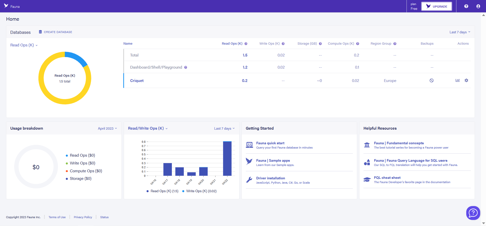
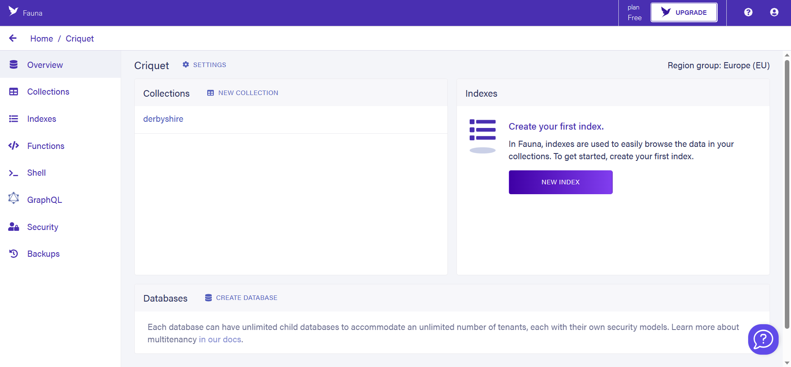
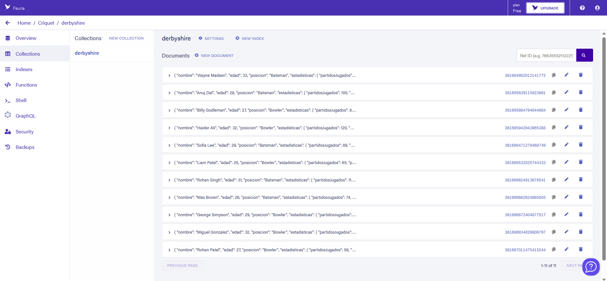

[](https://classroom.github.com/a/hneiFYl3)
[](https://classroom.github.com/online_ide?assignment_repo_id=10347953&assignment_repo_type=AssignmentRepo)

# Información del estudiante

* **Nombre y apellidos**: Francisco Javier Jiménez Aznar
* **Dirección de correo electrónico**: fjja0004@red.ujaen.es
* **Tablero de Trello**: https://trello.com/b/dNPOwWkO/pr%C3%A1ctica3d%C3%A1gil
* **Deporte asignado**: Críquet

# Información de la base de datos en Fauna

## Home


## Base de datos


## Colección


## Documentos JSON de la colección
```js

{
    "nombre": "Wayne Madsen",
    "edad": 33,
    "posicion": "Batsman",
    "estadisticas": {
      "partidosJugados": 80,
      "puntuacionPromedio": 38.7,
      "puntuacionMaxima": 95,
      "puntuacionMinima": 5
    },
    "historialEquipos": [
      "Wellington Wizards",
      "Lahore Lions"
    ],
    "nacionalidad": "Australia",
    "fechaNacimiento": "1990-03-15",
    "peso": 80.2,
    "altura": 1.85
  }

  {
    "nombre": "Anuj Dal",
    "edad": 28,
    "posicion": "Batsman",
    "estadisticas": {
      "partidosJugados": 100,
      "puntuacionPromedio": 42.3,
      "puntuacionMaxima": 120,
      "puntuacionMinima": 10
    },
    "historialEquipos": [
      "Barbados Buccaneers",
      "Cape Town Crusaders",
      "Mumbai Mavericks"
    ],
    "nacionalidad": "India",
    "fechaNacimiento": "1995-06-18",
    "peso": 75.6,
    "altura": 1.78
  }

  {
    "nombre": "Billy Godleman",
    "edad": 27,
    "posicion": "Bowler",
    "estadisticas": {
      "partidosJugados": 80,
      "puntuacionPromedio": 35.2,
      "puntuacionMaxima": 100,
      "puntuacionMinima": 5
    },
    "historialEquipos": [
      "Wellington Wizards",
      "Sydney Stars"
    ],
    "nacionalidad": "Inglaterra",
    "fechaNacimiento": "1994-03-28",
    "peso": 80,
    "altura": 1.84
  }

  {
    "nombre": "Haider Ali",
    "edad": 32,
    "posicion": "Bowler",
    "estadisticas": {
      "partidosJugados": 120,
      "puntuacionPromedio": 12.6,
      "puntuacionMaxima": 40,
      "puntuacionMinima": 2
    },
    "historialEquipos": [
      "Colombo Commanders",
      "Bengal Tigers",
      "Chennai Cobras",
      "Barbados Buccaneers"
    ],
    "nacionalidad": "Sri Lanka",
    "fechaNacimiento": "1989-12-05",
    "peso": 72.4,
    "altura": 1.82
  }

 {
    "nombre": "Sofia Lee",
    "edad": 29,
    "posicion": "Batsman",
    "estadisticas": {
      "partidosJugados": 89,
      "puntuacionPromedio": 18.9,
      "puntuacionMaxima": 36,
      "puntuacionMinima": 2
    },
    "historialEquipos": [
      "Sydney Sixers",
      "Delhi Capitals",
      "Melbourne Renegades"
    ],
    "nacionalidad": "Australia",
    "fechaNacimiento": "1994-09-18",
    "peso": 63.2,
    "altura": 1.68
  }

  {
    "nombre": "Liam Patel",
    "edad": 25,
    "posicion": "Bowler",
    "estadisticas": {
      "partidosJugados": 65,
      "puntuacionPromedio": 47.3,
      "puntuacionMaxima": 140,
      "puntuacionMinima": 12
    },
    "historialEquipos": [
      "Melbourne Hurricanes",
      "Rajasthan Royals"
    ],
    "nacionalidad": "Australia",
    "fechaNacimiento": "1998-05-12",
    "peso": 78.6,
    "altura": 1.82
  }

  {
    "nombre": "Rohan Singh",
    "edad": 31,
    "posicion": "Batsman",
    "estadisticas": {
      "partidosJugados": 112,
      "puntuacionPromedio": 39.8,
      "puntuacionMaxima": 123,
      "puntuacionMinima": 7
    },
    "historialEquipos": [
      "Kings XI Punjab",
      "Chennai Super Kings"
    ],
    "nacionalidad": "India",
    "fechaNacimiento": "1990-01-08",
    "peso": 76.5,
    "altura": 1.79
  }

{
    "nombre": "Max Brown",
    "edad": 26,
    "posicion": "Batsman",
    "estadisticas": {
      "partidosJugados": 74,
      "puntuacionPromedio": 12.6,
      "puntuacionMaxima": 33,
      "puntuacionMinima": 0
    },
    "historialEquipos": [
      "Perth Scorchers",
      "Sunrisers Hyderabad"
    ],
    "nacionalidad": "Australia",
    "fechaNacimiento": "1997-06-20",
    "peso": 72.3,
    "altura": 1.77
  }

{
    "nombre": "George Simpson",
    "edad": 29,
    "posicion": "Bowler",
    "estadisticas": {
      "partidosJugados": 67,
      "puntuacionPromedio": 41.2,
      "puntuacionMaxima": 102,
      "puntuacionMinima": 10
    },
    "historialEquipos": [
      "Delhi Capitals",
      "Melbourne Renegades",
      "Chennai Super Kings"
    ],
    "nacionalidad": "Inglaterra",
    "fechaNacimiento": "1994-07-12",
    "peso": 75.3,
    "altura": 1.81
  }

{
    "nombre": "George Simpson",
    "edad": 29,
    "posicion": "Bowler",
    "estadisticas": {
      "partidosJugados": 67,
      "puntuacionPromedio": 41.2,
      "puntuacionMaxima": 102,
      "puntuacionMinima": 10
    },
    "historialEquipos": [
      "Delhi Capitals",
      "Melbourne Renegades",
      "Chennai Super Kings"
    ],
    "nacionalidad": "Inglaterra",
    "fechaNacimiento": "1994-07-12",
    "peso": 75.3,
    "altura": 1.81
  }

{
    "nombre": "Rohan Patel",
    "edad": 27,
    "posicion": "Bowler",
    "estadisticas": {
      "partidosJugados": 56,
      "puntuacionPromedio": 8.5,
      "puntuacionMaxima": 22,
      "puntuacionMinima": 0
    },
    "historialEquipos": [
      "Hampshire",
      "Kent Cricket"
    ],
    "nacionalidad": "India",
    "fechaNacimiento": "1996-03-23",
    "peso": 68.7,
    "altura": 1.78
  }

```